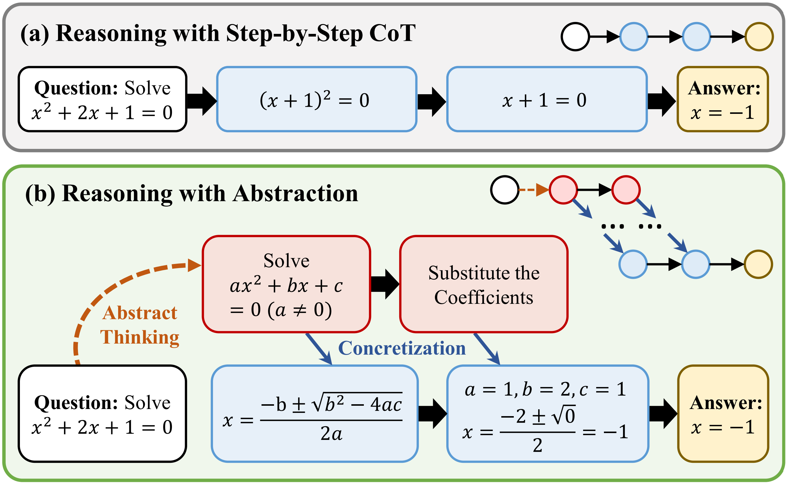
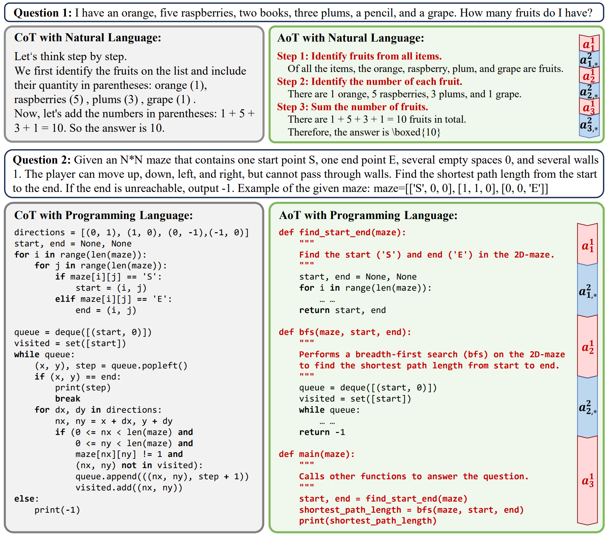

# Abstraction-of-Thought
<p align="center">
Repo for "<a href="https://arxiv.org/abs/2406.12442" target="_blank">Abstraction-of-Thought Makes Language Models Better Reasoners</a>" [EMNLP Findings 2024]
</p>
We introduce Abstraction-of-Thought (AoT), a novel structured reasoning format, to elicit language models to perform reasoning with abstraction.
AoT explicitly requires the inclusion of different levels of abstraction in the reasoning process, thus directing the language model to first consider the abstraction level before incorporating concrete details.
To align models with the AoT format, we present AoT-Collection, a generic finetuning dataset consisting of 348k high-quality samples with AoT reasoning processes, collected via an automated and scalable pipeline.

<br>

<p align="center">
    
    <br>
    <em>Figure 1: Reasoning with abstraction attempts to answer questions from the perspective of abstract essences, which may be overlooked by step-by-step Chain-of-Thought (CoT) reasoning. The reasoning process with abstraction contains multiple levels of abstract information.</em>
</p>

# AoT-Collection

[AoT-Collection](https://huggingface.co/datasets/Abstraction-of-Thought/AoT-Collection) comprises 348k high-quality data whose reasoning process is in AoT format, characterized by the following features:

- **Hybrid reasoning strategy.**
AoT-Collection incorporates reasoning processes expressed in both natural language and programming language. 
Models trained on such hybrid reasoning strategies can flexibly choose the suitable reasoning approach based on the type of test question, thereby handling more complex reasoning problems.

- **Broad task coverage.**
AoT-Collection is built upon the instruction-tuning dataset [FLAN Collection](https://github.com/google-research/FLAN/tree/main/flan/v2) that covers a wide range of tasks. 
This allows the AoT-Collection to encompass questions from various tasks, rather than being confined to a specific domain or task.

- **Scalability.**
AoT-Collection is collected through an automated pipeline, which allows it to scale up without relying on the efforts of human annotation.

You can find our data in huggingface: `https://huggingface.co/datasets/Abstraction-of-Thought/AoT-Collection`


<p align="center">
    
    <br>
    <em>Figure 2: Illustration of Abstraction-of-Thought (AoT) format with natural language (upper half) and programming language (lower half). Unlike the unconstrained CoT, AoT explicitly requires that different levels of abstraction be presented in the reasoning process. Here are examples of two-level abstraction AoT.</em>
</p>


# BBH Evaluation

## Setup

We recommend using [Conda](https://docs.conda.io/projects/miniconda) to manage your environment. We use [vLLM](https://github.com/vllm-project/vllm) (0.6.1) to accelerate inference. Run the following commands to setup your environment:

```sh
git clone https://github.com/Raising-hrx/Abstraction-of-Thought.git
cd Abstraction-of-Thought
conda create -n aot python=3.10
conda activate aot
pip install -r requirements.txt
```

## Inference

We release our trained model `Llama-3-8B-AoT`, which is the `Llama-3-8B` base model tuned in our AoT-Collection.
You can find the trained model in huggingface: `https://huggingface.co/Abstraction-of-Thought/Llama-3-8B-AoT`

We provide a script for inference.

Config the `path` in [scripts/BBH_inference.sh](scripts/BBH_inference.sh) and run the following command:

```sh
bash scripts/BBH_inference.sh
```

## Evaluation

To evaluate the predicted answer, run the following command:

```sh
cd code
python show_result.py
```


# Citation
If you find this repository helpful, please consider citing our paper.
```
@inproceedings{hong2024aot,
  title={Abstraction-of-Thought Makes Language Models Better Reasoners},
  author={Ruixin Hong, Hongming Zhang, Xiaoman Pan, Dong Yu and Changshui Zhang},
  booktitle={Proceedings of the 2024 Conference on Empirical Methods in Natural Language Processing. ({EMNLP})},
  year={2024}
}
```